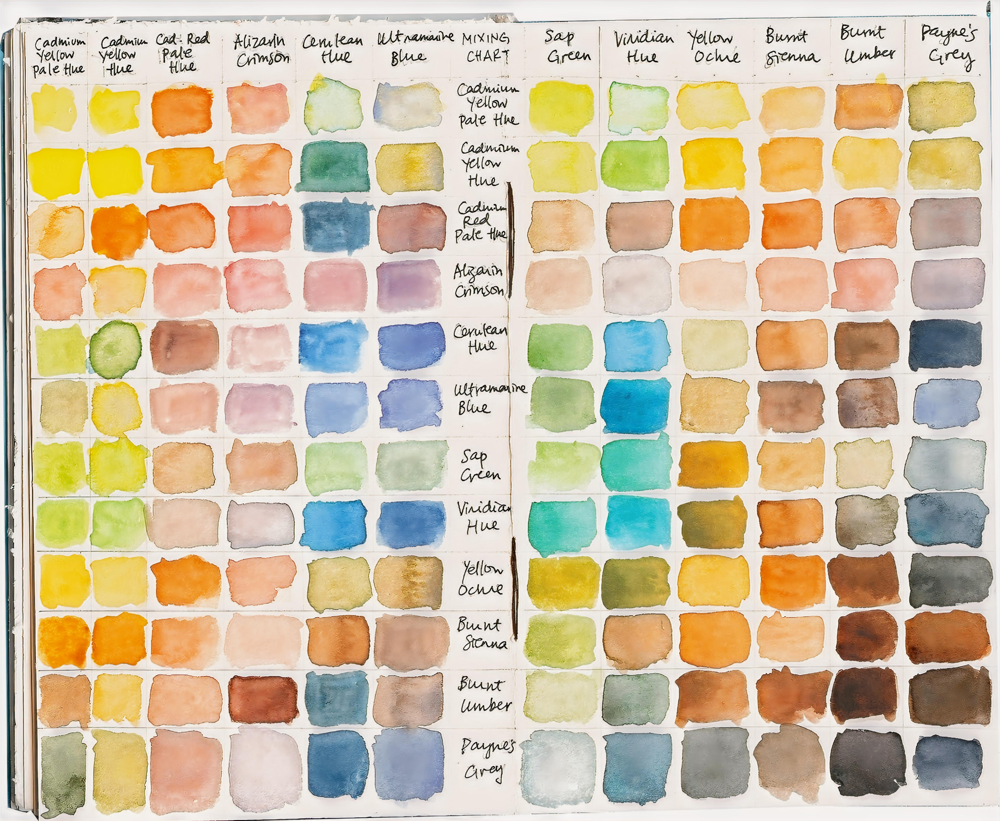

# DigitalFilm

DigitalFilm: Use a neural network to simulate film style.   
https://github.com/SongZihui-sudo/digitalFilm

---
layout: top-title-two-cols
color: indigo
---


::title::
DigitalFilm  

::left::

**Rollei Infrared 400 Sample 1**


::right::

**Rollei Infrared 400 Sample 2**

.jpg)

---
layout: top-title-two-cols
color: indigo
---

::title::
DigitalFilm  


::left::

**Kodak Gold 200 Sample 1**


::right::

**Kodak Gold 200 Sample 2**

.jpg)

---
layout: top-title-two-cols
color: indigo
---

::title::
DigitalFilm  

::left::

**Fuji Color 200 Sample 1**


::right::

**Fuji Color 200 Sample 2**

.jpg)

---
layout: top-title-two-cols
color: indigo
---

::title::
DigitalFilm  

::left::
Kodak gold 200



::right::
Fuji Color 200


---
layout: top-title
color: indigo
---

::title::
DigitalFilm

::content::

# Usage

There is a simple application in the `app` folder.
```bash
python digitalFilm.py [-v/-h/-g] -i <input> -o <ouput> -m <model>
-v print version information
-h help information
-g graphical image selection
-i input image directory
-o output image directory
-m model directory
```

# Train

```bash
git clone https://github.com/SongZihui-sudo/digitalFilm.git
pip install -r requirement.txt
```
Prepare your digital photos and film samples in two separate folders.    

Run `DigitalFilm.ipynb` to train.

---
layout: top-title
color: indigo
---

::title::
DigitalFilm

::content::

# Architecture


Converting digital photos to film style can be considered as an image style conversion task. Therefore, the overall architecture uses the cycleGAN network.

Moreover, it is difficult to obtain large-scale digital photos and film-style photos data, so an unsupervised approach is used to train using unpaired data.

---
layout: cover
---


# Thanks for watching